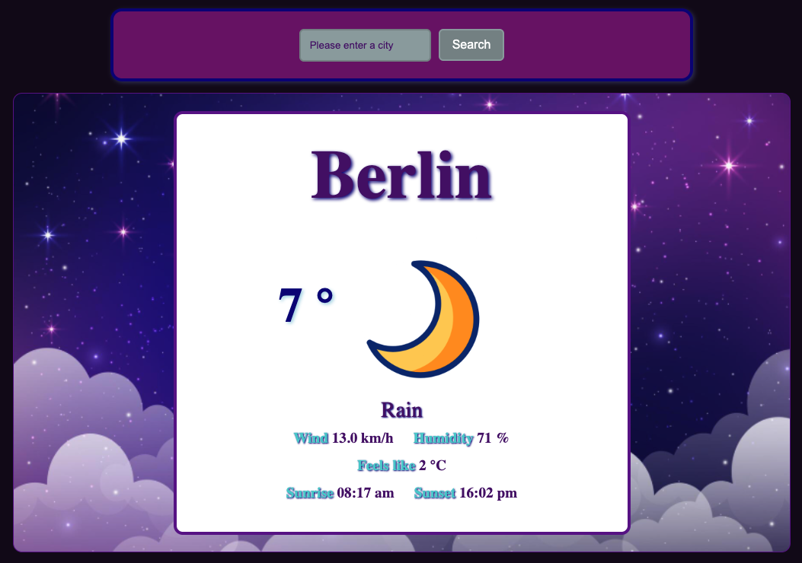
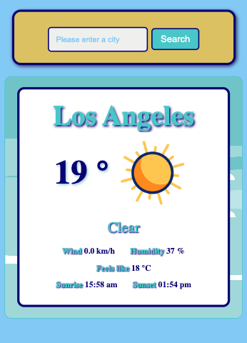

# Project Weather App 🌤️

## Intro

Welcome to the Weather App! This project is a simple and colorful weather application that displays the current daily weather for any city in the world. The app is designed to be easy to use and kid-friendly, with animated icons representing different weather conditions.

## Preview




### Or check it out on Netlify : [Project Weather App](https://project-react-weathermen-app.netlify.app/)

## Features

- **Search for any city**: Enter any city or country in the search bar and click the search button to display the weather information.
- **Weather Information**: The app displays information such as city, temperature, weather conditions, sunrise, and sunset times.
- **Dark Mode**: The view changes to a "dark mode" after sunset.
- **Responsive Design**: The app is mobile-friendly, thanks to the added media queries.

## Technologies Used

- **Vite**
- **React**
- **TypeScript**
- **CSS**
- **HTML**
- **Weather API**: Data is retrieved from a weather API.

## Design

- The design is freestyle, colorful, and aimed at being easy and fun for children to use.
- Animated icons are used to represent weather conditions.

## How to Use

1. Enter a city or country in the search bar.
2. Click the search button.
3. View the weather information displayed on the card.

## Development Setup

To set up the project locally, follow these steps:

1. Clone the repository:

```bash
git clone git@github.com:sharonVko/Project-React-Weather-App.git
```

2. Navigate to the project directory:

```
cd weather-app
```

3. Install the dependencies:

```
npm install
```

4. Start the development server:

```
npm run dev
```

5. Open your browser and navigate to http://localhost:5173.
